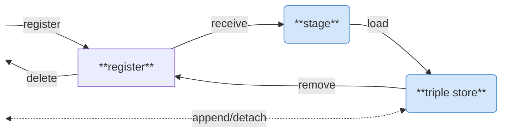

# n4o-graph-importer

> Import RDF data into the NFDI4Objects Knowledge Graph

This [web service](#api) implements a controlled workflow to import RDF data into the triple store of [NFDI4Objects Knowledge Graph](https://graph.nfdi4objects.net/). The service is provided [as Docker image](https://github.com/nfdi4objects/n4o-graph-importer) but it can also be run from sources for [development and testing](#development). 

## Table of Contents

- [Usage](#usage)
- [Configuration](#configuration)
- [API](#api)
  - [General endpoints](#general-endpoints)
    - [GET /status.json](#get-statusjson)
    - [GET /data/](#get-data)
  - [Terminologies](#terminologies)
    - [GET /terminology](#get-terminology)
    - [GET /terminology/:id](#get-terminologyid)
    - [PUT /terminology/:id](#put-terminologyid)
    - [DELETE /terminology/:id](#delete-terminologyid)
    - [PUT /terminology/](#put-terminology)
    - [GET /terminology/:id/stage/](#get-terminologyidstage)
    - [POST /terminology/:id/receive](#post-terminologyidreceive)
    - [GET /terminology/:id/receive](#get-terminologyidreceive)
    - [POST /terminology/:id/load](#post-terminologyidload)
    - [GET /terminology/:id/load](#get-terminologyidload)
    - [POST /terminology/:id/remove](#post-terminologyidremove)
    - [GET /terminology/namespaces.json](#get-terminologynamespacesjson)
  - [Collections](#collections)
    - [GET /collection/](#get-collection)
    - [GET /collection/schema.json](#get-collectionschemajson)
    - [PUT /collection/](#put-collection)
    - [POST /collection/](#post-collection)
    - [GET /collection/:id](#get-collectionid)
    - [PUT /collection/:id](#put-collectionid)
    - [DELETE /collection/:id](#delete-collectionid)
    - [GET /collection/:id/stage/](#get-collectionidstage)
    - [POST /collection/:id/receive](#post-collectionidreceive)
    - [GET /collection/:id/receive](#get-collectionidreceive)
    - [POST /collection/:id/load](#post-collectionidload)
    - [GET /collection/:id/load](#get-collectionidload)
    - [POST /collection/:id/remove](#post-collectionidremove)
  - [Mappings](#mappings)
    - [GET /mappings/](#get-mappings)
    - [GET /mappings/schema.json](#get-mappingsschemajson)
    - [GET /mappings/properties.json](#get-mappingspropertiesjson)
    - [PUT /mappings/](#put-mappings)
    - [POST /mappings/](#post-mappings)
    - [GET /mappings/:id](#get-mappingsid)
    - [PUT /mappings/:id](#put-mappingsid)
    - [DELETE /mappings/:id](#delete-mappingsid)
    - [POST /mappings/:id/append](#post-mappingsidappend)
    - [POST /mappings/:id/detach](#post-mappingsiddetach)
    - [GET /mappings/:id/stage/](#get-mappingsidstage)
    - [POST /mappings/:id/receive](#post-mappingsidreceive)
    - [GET /mappings/:id/receive](#get-mappingsidreceive)
    - [POST /mappings/:id/load](#post-mappingsidload)
    - [GET /mappings/:id/load](#get-mappingsidload)
    - [POST /mappings/:id/remove](#post-mappingsidremove)
- [Development](#development)
- [License](#license)

## Usage

Three kinds of data can be imported seperately:

- **terminologies** such as ontologies and controlled vocabularies (as listed in [BARTOC])
- **collections** of arbitrary RDF data from open research data repositories
- **mappings** between resources from terminologies

Each terminology, and each collection is imported into an individual named graph. Mappings are also grouped in named graph for individual mapping sources. Terminology graph URIs equal to BARTOC URIs. Collection graph URIs and mapping source graphs consist of URI namespace <https://graph.nfdi4objects.net/collection/> and <https://graph.nfdi4objects.net/mappings/>, respectively, followed by a numeric identifier. Metadata of terminologies, collections, and mappings sources is merged into two additional graphs, <https://graph.nfdi4objects.net/terminology/>, <https://graph.nfdi4objects.net/collection/>, and <https://graph.nfdi4objects.net/mappings/> respectively.

Importing is controlled via [an HTTP API](#api) in three steps:

1. **register**: metadata is retrieved, collected in a **registry** and written to the triple store
2. **receive**: data is retrieved into a **stage** directory where it is validated, filtered, and a report log is generated
2. **load**: processed data is loaded into the triple store

Register can be undone by additional step **delete**. Load and receive can be undone by step **remove**. Mappings can also be injested and withdraw directly into/from the triple store via **append/detach** to support non-durable live-updates.

The application does not include any methods of authentification. It is meant to be deployed together with components described in [n4o-graph](https://github.com/nfdi4objects/n4o-graph) repository. In particular:

- [n4o-fuseki](https://github.com/nfdi4objects/n4o-fuseki): RDF triple store
- [n4o-graph-apis](https://github.com/nfdi4objects/n4o-graph-apis): web interface and public SPARQL endpoint

## Configuration

The web service and its Docker image can be configured via environment variables:

- `TITLE`: title of the application. Default: `N4O Graph Importer`
- `BASE`: base URI of named graphs. Default: `https://graph.nfdi4objects.net/`
- `FRONTEND`: URL of [n4o-graph-apis] instance. Default is the value of `BASE`
- `SPARQL`: API endpoint of SPARQL Query protocol, SPARQL Update protocol and SPARQL Graph store protocol. Default: <http://localhost:3030/n4o>.
- `STAGE`: writeable stage directory. Default: `stage`
- `DATA`: local data directory for file import

If the data directory contains a file `bartoc.json` with an array of JSKOS records from BARTOC, this file is used as source of terminology metadata instead of BARTOC API. Script `update-terminologies` in this repository can be used to get a subset from BARTOC, including all [terminologies listed in NFDI4Objects](https://bartoc.org/vocabularies?partOf=http://bartoc.org/en/node/18961).

## API

### General endpoints

#### GET /status.json

Get curent information about the application as JSON object. This includes the [configuration](#configuration) with lowercase field names and field `connected` whether the SPARQL API endpoint can be accessed.

#### GET /data/

List and get files from local data directory.

### Terminologies

Terminologies are identified by their [BARTOC] identifier. Terminology data should be registered before receiving collection data to detect use of terminologies in collections. 

#### GET /terminology

Return the list of registered terminologies.

#### GET /terminology/:id

Return metadata of a registered terminology.

#### PUT /terminology/:id

Register a terminology or update its metadata from BARTOC. The metadata is directly added to the triple store. Updates may lead to errors in description of terminologies because removal of statements is limited to simple triples with terminology URI as subject!

#### DELETE /terminology/:id

Unregister a terminology and remove it from stage directory and triple store. This implies [DELETE /terminology/:id/remove](#delete-terminologyidremove).

#### PUT /terminology/

Register a list of terminologies. This is only allowed as long as the current list is empty. The response body is expected to be a JSON array with objects having key `uri` with the BARTOC URI like this:

~~~json
[
 { "uri": "http://bartoc.org/en/node/18274" },
 { "uri": "http://bartoc.org/en/node/20533" }
]
~~~

Other fields are ignored so the return value of [GET /terminology/](#get-terminology) can be used as payload.

#### GET /terminology/:id/stage/

List and get files of the stage directory of a terminology.

#### POST /terminology/:id/receive

Receive terminology data. The location of the data is going to be extracted from terminology metadata from BARTOC but this has not been implemented yet. For now pass query parameter `from` instead to locate an URL or the name of a file in the data directory. Format must be RDF/Turtle for file extension `.ttl` or `.nt`, otherwise RDF/XML.

#### GET /terminology/:id/receive

Get latest receive log of a terminology.

#### POST /terminology/:id/load

Load received terminology data into the triple store.

#### GET /terminology/:id/load

Get latest load log of a terminology. 

#### POST /terminology/:id/remove

Remove terminology data from the triple store and from staging area. The terminology will still be registered and its metadata is not removed from the triple store.

#### GET /terminology/namespaces.json

Return registered URI namespaces forbidden to be used in RDF subjects. The result is a JSON object with terminology URIs as keys and namespaces as values. For instance the SKOS (<http://bartoc.org/en/node/18274>) namespace is <http://www.w3.org/2004/02/skos/core#> so RDF triples with subjects in this namespace can only be added to the knowledge graph via `/terminology/18274`.

### Collections

Collections are described in a custom JSON format described by JSON Schema [collection-schema.json](collection-schema.json). This JSON data is enriched with field `id` and internally converted to RDF for import into the knowledge graph. In its simplest form, a collection should contain a name, an URL, and a license:

~~~json
{
  "name": "test collection",
  "url": "https://example.org/",
  "license": "https://creativecommons.org/publicdomain/zero/1.0/"
}
~~~

When registered, the collection is assigned an id, and a corresponding URI.

#### GET /collection/

Return the list of registered collections (metadata only).

#### GET /collection/schema.json

Return the JSON Schema used to validation collection metadata. See file [collection-schema.json](collection-schema.json). Collection field `id` is required by the schema but it gets assigned automatically in most cases.

#### PUT /collection/

Register a list of collections. This is only allowed if the current list is empty.

#### POST /collection/

Register a new collection or update metadata of a registered collection.

#### GET /collection/:id

Return metadata of a specific registered collection.

#### PUT /collection/:id

Update metadata of a specific registered collection or register a new collection.

#### DELETE /collection/:id 

Unregister a collection and remove it from the triple store and staging area. This implies [DELETE /collection/:id/remove](#delete-collectionidremove).

#### GET /collection/:id/stage/

List and get files of the stage directory of a collection.

#### POST /collection/:id/receive

Receive and process collection data. The location of the data is taken from collection metadata field `access` if existing. The location can be overridden with optional query parameter `from` with an URL or a file name from local data directory.

#### GET /collection/:id/receive

Get latest receive log of a collection.

#### POST /collection/:id/load

Load received and processed collection data into the triple store.

#### GET /collection/:id/load

Get latest load log of a collection.

#### POST /collection/:id/remove

Remove collection data from the triple store and from staging area. The collection will still be registered and its metadata is not removed from the triple store.

### Mappings

Mappings are grouped in **mapping sources**, which correspond to concordances or lists of mappings.

#### GET /mappings/

Return the list of registered mappings sources.

#### GET /mappings/schema.json

Return the [mapping sources schema](mappings-schema.json)) used to validate mapping sources.

#### GET /mappings/properties.json

Get a list of supported mapping properties. By default this is the list of [SKOS Mapping properties](https://www.w3.org/TR/skos-reference/#mapping) plus `owl:sameAs`, `owl:equivalentClass`, `owl:equivalentProperty`, `rdfs:subClassOf`, and `rdfs:subPropertyOf`.

#### PUT /mappings/

Register a list of mappings sources. All existing mapping sources and mappings will be deleted.

#### POST /mappings/

Register a new mapping source or update metadata of a mapping source.

#### GET /mappings/:id

Return a specific mapping source.

#### PUT /mappings/:id

Update metadata of a specific mapping source.

#### DELETE /mappings/:id 

Unregister a mapping source and remove it from the triple store and staging area. This implies [DELETE /mappings/:id/remove](#delete-mappingsidremove).

#### POST /mappings/:id/append

Directly add mappings to the triple store, bypassing the receive/load workflow. Directly added triples are not stored in the staging area so they will not persist a load operation of the selected mapping source.

#### POST /mappings/:id/detach

Directly remove mappings from the triple store. This operation is not reflected in the staging area so it will not persist a load operation of the seleceted mapping source.

#### GET /mappings/:id/stage/

List and get files of the stage directory of a mapping source.

#### POST /mappings/:id/receive

Receive and process mappings from a mapping source. The location of the data is taken from mapping source field `access` if existing. The location can be overridden with optional query parameter `from` with an URL or a file name from local data directory. The file format is derived from file name extension, unless explicitly specified in metadata field `access.format`. Mappings can be given as:

- plain RDF triples in Turtle syntax (extension `.nt` or `.ttl`)
- plain RDF triples in RDF/XML syntax (extension `.rdf` or `.xml`)
- newline delimited JSON with [JSKOS Concept Mappings](https://gbv.github.io/jskos/#concept-mappings) (extension `.ndjson`), only 1-to-1 mappings are included

Mapping metadata such as date of creation and annotations is ignored.

#### GET /mappings/:id/receive

Get latest receive log of a mapping source.

#### POST /mappings/:id/load

Load received and processed mapping into the triple store.

#### GET /mappings/:id/load

Get latest load log of a mapping source.

#### POST /mappings/:id/remove

Remove mappings of a specific mapping source from the triple store and from staging area. The mapping source will still be registered and its metadata is not removed from the triple store.

## Development

Requires basic development toolchain (`sudo apt install build-essential`) and Python 3 with module venv to be installed.

- `make deps` installs Python dependencies in a virtual environment in directory `.venv`
- `make test` runs a test instance of the service with a temporary triple store
- `make start` runs the service without restarting
- `make api` runs the service with automatic restarting (requires install Node module `nodemon` with `npm install`)
- `make lint` checks coding style
- `make fix` cleans up some coding style violations

Best use the Docker image [n4o-fuseki] to start a triple store configured to be used with the importer:

~~~sh
docker run --rm -p 3030:3030 ghcr.io/nfdi4objects/n4o-fuseki:main
~~~

To also inspect the content of the triple store, use [n4o-graph-apis].

*TODO: add description how to run this container*

<!--
~~~sh
docker run --rm --net=host -p 8000:8000 -v ./config-apis.yaml:/app/config.yaml:ro -v ./stage:/app/stage:ro ghcr.io/nfdi4objects/n4o-graph-apis:main
~~~
-->

The Docker image of n4o-graph-importer is automatically build on GitHub. To locally build the image for testing:

~~~sh
docker compose create
~~~

## License

Licensed under [Apache License](http://www.apache.org/licenses/) 2.0.

[BARTOC]: https://bartoc.org/
[n4o-fuseki]: https://github.com/nfdi4objects/n4o-fuseki#readme 
[n4o-graph-apis]: https://github.com/nfdi4objects/n4o-graph-apis#readme 
