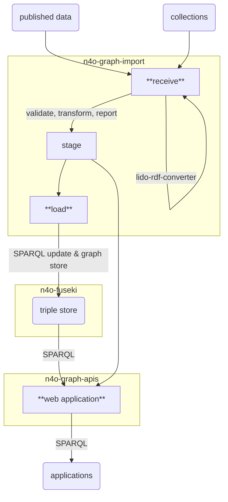

# n4o-graph-importer

> Import RDF data into the NFDI4Objects Knowledge Graph

This component imports RDF data of a collection or a terminology into the triple store of NFDI4Objects Knowledge Graph. The import consists of two steps:

1. **receive**: data is copied into a **stage** directory where it is validated, filtered, and a report is generated.
2. **load**: on success the processed data is loaded into the triple store

## Data flow

## Usage

This component can be used both as Docker image (recommended) and from sources (for development and testing).

Two Docker volumes (or local directories) are used:

- `./stage` the stage directory with subdirectories
  - `./stage/collection/$ID` for collections with collection id `$ID`
  - `./stage/terminology/$ID` for terminologies with BARTOC id `$ID`
- `./data` a directory read RDF data from (not required if running from sources)

Related components:

- [n4o-graph-apis](https://github.com/nfdi4objects/n4o-graph-apis): web interface and public SPARQL endpoint
- [n4o-fuseki](https://github.com/nfdi4objects/n4o-fuseki): RDF triple store

### Receive

*not fully implemented yet*

### Load

Load collection data and metadata from stage directory into triple store:

~~~sh
./load-collection 0     # change to another collection id except for testing
~~~

Load terminology data into triple store:

*not fully implemented yet*

## Configuration

Environment variables:

- `SPARQL`: API endpoint of SPARQL Update protocol. Default: <http://localhost:3030/n4o>.
- `SPARQL_UPDATE`: API endpoint of SPARQL Graph store protocol. Default: same as `SPARQL`

## Development

See `test/test.sh` for a test script, also run via GitHub action.

Locally build Docker image for testing:

~~~sh
docker compose create
~~~

Locally run Docker container from image:

~~~sh

Internal scripts (don't call directly!):

- `load-collection`
- `load-collection-metadata`
- `load-rdf-graph`
- `sparql-update`
- `collection-context.json`

## License

Licensed under [Apache License](http://www.apache.org/licenses/) 2.0.
