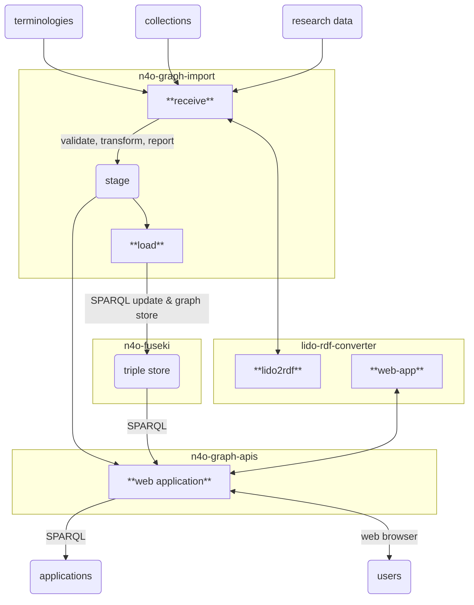

# n4o-graph-importer

> Import RDF data into the NFDI4Objects Knowledge Graph

This component imports RDF data of a collection or a terminology into the triple store of NFDI4Objects Knowledge Graph. The import consists of two steps:

1. **receive**: data is copied into a **stage** directory where it is validated, filtered, and a report is generated.
2. **load**: on success the processed data is loaded into the triple store

## Data flow

## Usage

This component can be used both as Docker image (recommended) and from sources (for development and testing). In both cases the importer is executed via individual command line scripts.

Two Docker volumes (or local directories) are used:

- `./stage` the stage directory with subdirectories
  - `./stage/collection/$ID` for collections with collection id `$ID`
  - `./stage/terminology/$ID` for terminologies with BARTOC id `$ID`
- `./data` a directory read RDF data from (not required if running from sources)

Related components:

- [n4o-graph-apis](https://github.com/nfdi4objects/n4o-graph-apis): web interface and public SPARQL endpoint
- [n4o-fuseki](https://github.com/nfdi4objects/n4o-fuseki): RDF triple store
- [lido-rdf-converter](https://github.com/nfdi4objects/lido-rdf-converter): convert LIDO format to RDF

With Docker:

~~~
docker compose -f docker-compose-graph.yml up --force-recreate --remove-orphans -V
docker compose -f docker-compose-graph.yml run importer
~~~

### Import terminologies

The list of terminologies to be loaded is managed in BARTOC. Download URLs for selected terminologies are hard-coded in file [`terminology-data.csv`](terminology-data.csv) (until a better way has been established to manage this information). The following data formats are supported:

- [rdf/turtle](http://format.gbv.de/rdf/turtle) (subsumes N-Triples)
- [rdf/xml](http://format.gbv.de/rdf/xml)
- [jskos](http://format.gbv.de/jskos) (`.ndjson`)

To update the list of terminologies from BARTOC run:

~~~sh
npm run -s update-terminologies
~~~

This generates files `terminologies.json`, `namespaces.json`, and `terminologies.ttl` in directory `stage/terminology/`, required for importing collections and terminologies. This metadata about terminologies is loaded into the triple store with:

~~~sh
./load-terminologies-metadata
~~~

To receive and load individual terminology data (here exemplified with SKOS terminology, <http://bartoc.org/en/node/18274>:

~~~sh
./receive-terminology http://bartoc.org/en/node/18274
./load-terminology http://bartoc.org/en/node/18274
~~~

Data and reports are stored in `stage/terminology/18274`.

### Receive collections

*not fully implemented yet*

~~~sh
./receive-collection 0
~~~

### Load collections

Load collection data and metadata from stage directory into triple store:

~~~sh
./load-collection 0     # change to another collection id except for testing
~~~

## Configuration

Environment variables:

- `SPARQL`: API endpoint of SPARQL Update protocol. Default: <http://localhost:3030/n4o>.
- `SPARQL_UPDATE`: API endpoint of SPARQL Graph store protocol. Default: same as `SPARQL`

## Development

See `test/test.sh` for a test script, also run via GitHub action.

Locally build Docker image for testing:

~~~sh
docker compose create
~~~

To run with related components there is a docker-compose file currently being developed:

~~~sh
docker compose -f docker-compose-graph.yml up --remove-orphans
docker compose -f docker-compose-graph.yml run importer
~~~

## License

Licensed under [Apache License](http://www.apache.org/licenses/) 2.0.
